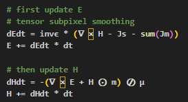

Photonic and RF simulation and inverse design in just few lines of code! Fully featured, fully differentiable, GPU accelerated FDTD engine and geometry optimizer. Experimental release: expect occasional critters..

https://github.com/user-attachments/assets/9c2857dc-d3fa-4744-8089-784c62f593a2

Features 
- Automatic differentiation (AD) compatible for adjoint optimization
- Optional GPU acceleration 
- Length scale controlled geometry optimizer 
- Nonlinear and anisotropic materials 
- Tensor subpixel smoothing for accuracy 
- Adaptive graded grid and Float16 support for speed 
- PML, periodic, PEC, PMC boundaries 
- Modal sources, plane waves, Gaussian beams
- Modal monitors, DFT fields 
- Concise mathematical syntax for update equations

Application specific [Python API](https://paulxshen.github.io/Luminescent.jl/luminescent.html) UI and `gdsfactory` integration for simulation and inverse design 
- Photonic integrated circuits (PIC) - available now
- Metasurface optics and thin films - please request 
- RF microstrip and patch atennas - please request 
 
General purpose backend API is in Julia and is not documented (unless there's interest). Look at the beauty of Maxwell's equations in our [update loop](https://github.com/paulxshen/Luminescent.jl/blob/master/src/core/update.jl)! Other FDTD packages make it so ugly :(

[Follow us](https://www.linkedin.com/company/luminescent-ai/about) on our new Linkedin page for package updates and bug fixes! Feel free to raise an issue. We respond daily. Star us if you like this repo :)

Paul Shen, <pxshen@alumni.stanford.edu>
