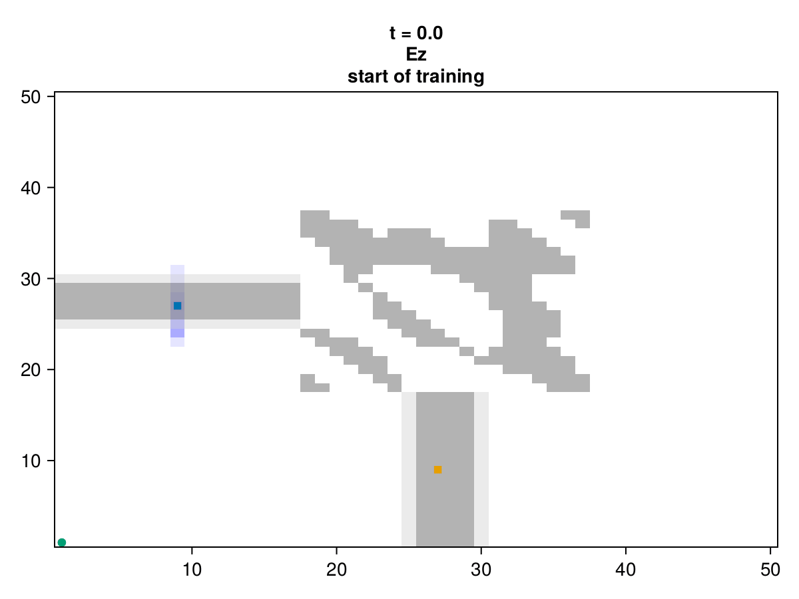
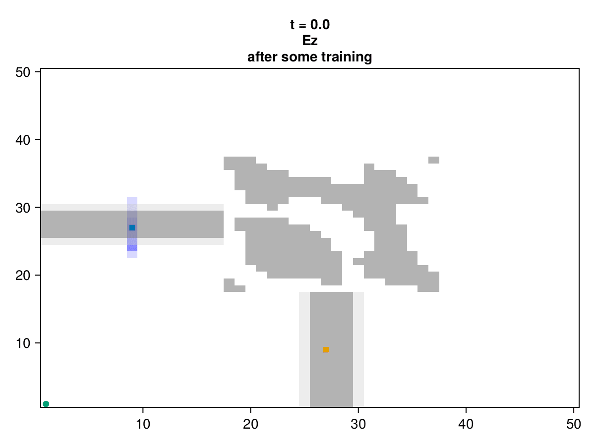

Working draft of a differentiable FDTD engine for inverse design in photonics, acoustics & RF.
Documentation at https://paulxshen.github.io/Luminescent.jl/
Discussion & updates at https://discourse.julialang.org/t/pre-ann-differentiable-fdtd-for-inverse-design-in-photonics-acoustics-and-rf/105405/12

