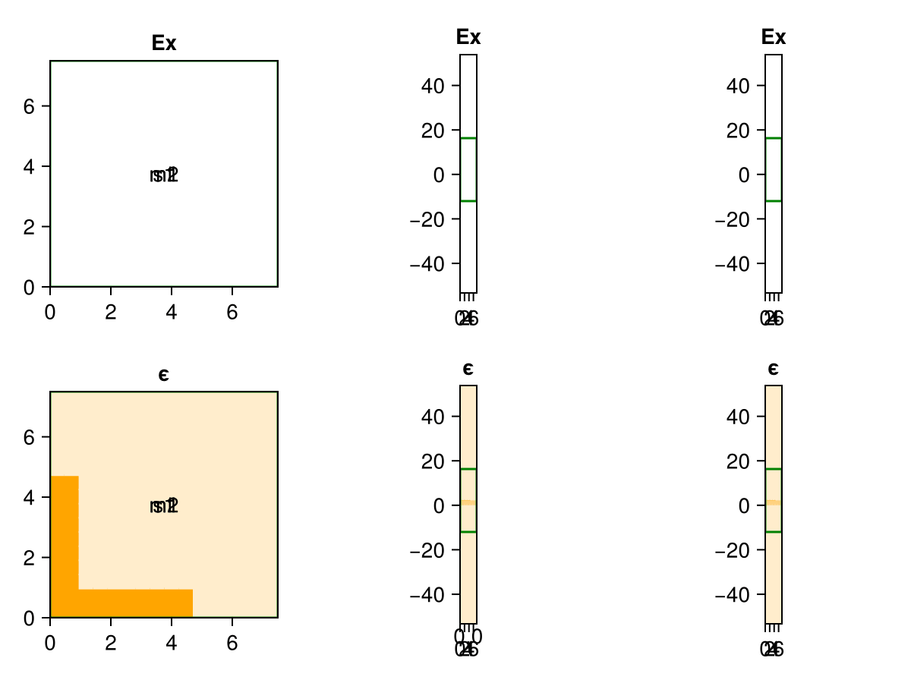
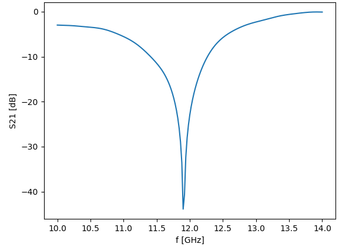
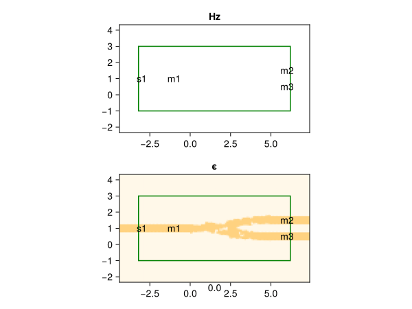
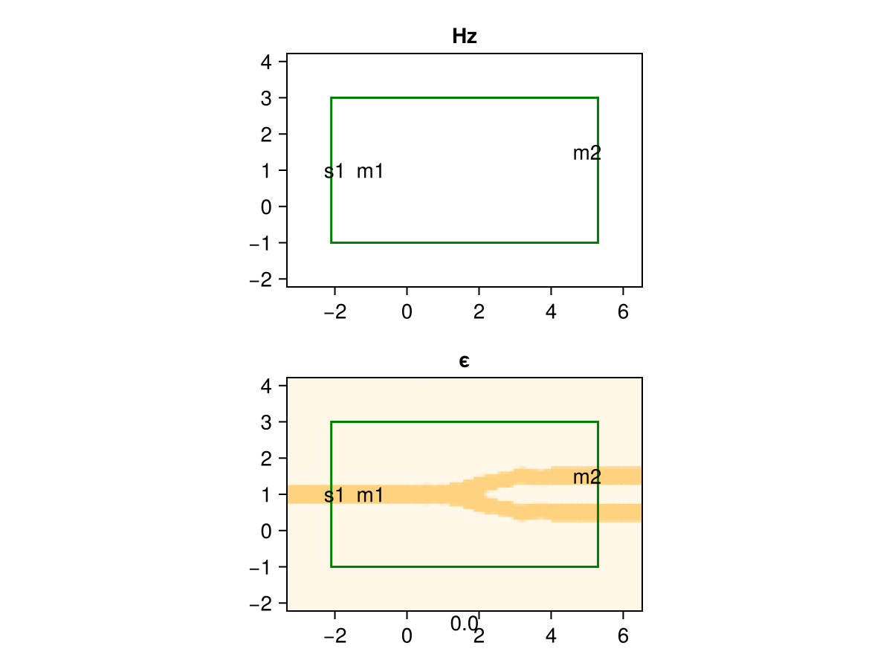
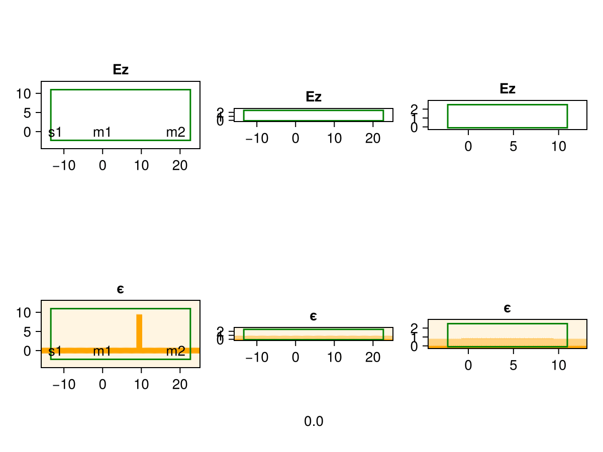
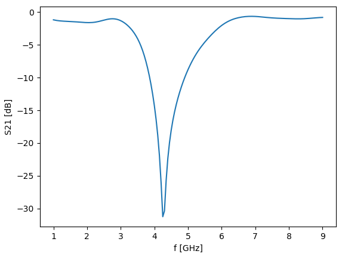

# Luminescent AI - FDTD Simulation and Inverse Design

2025/05/26  
Paul Shen  
<pxshen@alumni.stanford.edu>  

# Summary

[Luminescent AI](https://luminescentai.com/) enables generative design and simulation of electromagnetic structures  in just a few lines of code! We help design next generation photonic integrated circuits, optical metasurfaces, RF and microwave circuits, and antennas in diverse industries including consumer electronics, automotive, telecom, datacenters and quantum computing. We created an automatic differentiation (AD) and GPU compatible finite difference time domain (FDTD) simulator and geometry generator.


[GitHub](https://github.com/paulxshen/Luminescent.jl): Star us :) We respond to issues within a day  
[LinkedIn](https://www.linkedin.com/company/luminescent-ai/about): Follow us for new features and bug fixes  
[Company](luminescentai.com): Consulting, collaboration, publication opportunities available  

Email: pxshen@alumni.stanford.edu info@luminescentai.com   
WhatsApp: 650-776-7724  
WeChat: pxshen1230  

Experimental release 🥼. Expect critters  🐛🐞

# Features
 
**Easy**
- Generative design and simulation in just few lines of Python code!
- Broadband and multimode S-parameters 
- Near and far field radiation patterns
- Application specific API via gdsfactory integration
    - Photonic integrated circuits 
    - Optical metasurfaces
    - RF and microwave circuits: microstrip, CPWG
    - Planar antennas
- General API via .stl / .step  3D geometry import
    - 3D antennas
    - Biomedical RF

**Fast**
- GPU acceleration
- Adaptive material dependent meshing 
- Mesh override regions

**Smart**
- Generative AI design of 2D and 3D structures
- Fully differentiable for inverse design
- Automatic differentiation (AD) gradients for adjoint optimization
- Length scale controlled geometry optimizer with fabrication constraints  

**Comprehensive**
- Tensor subpixel smoothing for accuracy
- Embedded mode solver for modal sources and monitors
- Modal sources, plane waves, Gaussian beams, arbitrary current excitations
- Oblique sources and monitors
- PML, periodic, PEC, PMC boundaries
- Nonlinear, dispersive and anisotropic materials

# Product tiers
Core code is open source. Build code and advanced features are proprietary. 
- Forever free tier
    - CPU binaries with core features
    - Fully local, run anywhere
- Lux enterprise tier
    - Everything in free tier
    - Advanced features eg GPU binaries
    - Full ownership, perpetual license
    - No cloud or license server lock-in 
    - 1yr of support and updates

# Installation
Fill out new user [form](https://forms.gle/fP9wAkdJinT8t66w8) to obtain free tier Linux install script.
# Metasurfaces
## Simulation examples
### Microwave frequency selective surface (FSS)
https://colab.research.google.com/drive/1ofB-iSfh7uSQS7AqfzSkgbJu3NG1mPsh?usp=sharing


### Metasurface lens (getting started tutorial)
## Inverse design examples
### Metagrating

# Photonic integrated circuits
## Simulation examples
### Ring resonator (getting started tutorial)

https://colab.research.google.com/drive/1XHC2bEULDzIYSUe4WI48Cmy8a77lArUu?usp=sharing


## Inverse design examples
### Wavelength demultiplexer (getting started tutorial)
https://colab.research.google.com/drive/13oneyRcUwEonLCk-PwB8Lrl_jMgzNn5n?usp=sharing


<!-- ### Splitter
https://colab.research.google.com/drive/1Awtw9slUD9TKu1Zezg9RlarJ1z5aRB0L?usp=sharing
 -->

### Symmetric crossing
https://colab.research.google.com/drive/1CJ-eLSzOgb9d4W7tmFd3k2h4qYs6Q9cG?usp=sharing

```python
```

# RF and microwave circuits
## Simulation examples
### Microstrip quarter wavelength stub filter
https://colab.research.google.com/drive/1ymWD36Xvx4jcbf2-p-MeKZIwU2PzbAOv?usp=sharing


## Inverse design examples
### Microstrip bandpass filter

# Planar antennas (proprietary)
## Simulation examples
### Inverted F antenna
## Inverse design examples
### Patch antenna

# 3D antennas (proprietary)
## Simulation examples
### Coaxial fed horn antenna
## Inverse design examples
### 3D printed RF lens

# Biomedical RF (proprietary)
## Simulation examples
### Human head SAR 
