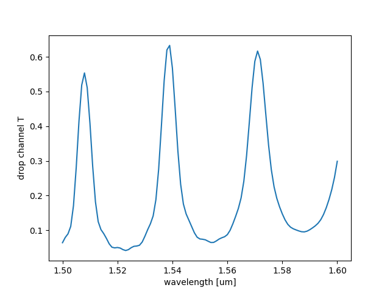

# Luminescent AI - FDTD Simulation and Inverse Design

2025/04/25  
Paul Shen <pxshen@alumni.stanford.edu>  

# Summary

[Luminescent AI](https://luminescentai.com/) enables generative design and simulation of electromagnetic structures  in just a few lines of code! We help design next generation photonic integrated circuits, RF microstrip circuits, antennas and metasurfaces in diverse industries including consumer electronics, automotive, telecom, datacenters and quantum computing.

We created an automatic differentiation (AD) and GPU compatible finite difference time domain (FDTD) simulator and geometry generator. CPU only installer (binaries) on Linux and Windows are freely available and used in this notebook! GPU installer and advanced functionalities are premium features.


[GitHub](https://github.com/paulxshen/Luminescent.jl): Star us :) We respond to issues within a day  
[LinkedIn](https://www.linkedin.com/company/luminescent-ai/about): Follow us for new features and bug fixes  
[Company](luminescentai.com): Consulting, collaboration, publication opportunities available  

Email: pxshen@alumni.stanford.edu info@luminescentai.com   
WhatsApp: 650-776-7724  
WeChat: pxshen1230  

Experimental release 🥼. Expect critters  🐛🐞

# Features
 
**Easy**
- Generative design and simulation in just few lines of Python code!
- Automated S-parameters calculation supporting broadband and multimode
- Application specific API
    - Photonic integrated circuits with gdsfactory integration
    - ✨Optical metasurfaces
    - ✨RF microstrip, CPWG circuits and patch antennas
- ✨General 3D geometry import via .stl, .step  

**Fast**
- ✨GPU acceleration
- Adaptive meshing slashes cell count 

**Smart**
- Generative AI design of 2D and 3D structures
- Fully differentiable for inverse design
- Automatic differentiation (AD) gradients for adjoint optimization
- Length scale controlled geometry optimizer with fabrication constraints  

**Comprehensive**
- Tensor subpixel smoothing for accuracy
- Embedded mode solver for modal sources and monitors
- Modal sources, plane waves, Gaussian beams, arbitrary current excitations
- Oblique sources and monitors
- PML, periodic, PEC, PMC boundaries
- ✨Nonlinear, dispersive and anisotropic materials

✨Premium features

# Installation

Contact us for DOWNLOAD_LINK

```
%%shell
pip install -U luminescent &> /dev/null
gdown DOWNLOAD_LINK
tar -xf lumi.tar.gz  -C /usr/local/
```
```
import os
os.environ['PATH'] += ':/usr/local/Luminescent/bin'
```
# Application: photonic integrated circuits
## Simulation examples
### Ring resonator (getting started tutorial)
```python
"""
Ring resonator sparams similar to [Lumerical example](https://optics.ansys.com/hc/en-us/articles/360042800293-Ring-resonator-getting-started-Design-and-initial-simulation). Lossy, FSR of few nm around 1.55um. Takes a long time because signal goes round and round before decaying.
"""

import luminescent as lumi
from gdsfactory.technology import LogicalLayer, LayerLevel, LayerStack
import gdsfactory as gf
import numpy as np
import os

path = os.path.join("runs", "ring")
radius = 3.1
width = 0.4
gap = 0.1
thickness = 0.18

# margins
source_port_margin = 2
zmargin_mode = 0.5
xmargin_mode = 0.5

# layers
WG = (1, 0)
CLAD = (2, 0)

# make component in gdsfactory. alternatively can import .gds into gdsfactory
c = gf.Component()
dut = c << gf.components.ring(radius=radius, width=width, layer=WG)
wg1 = c << gf.components.straight(length=2 * radius + width, width=width)
wg2 = c << gf.components.straight(length=2 * radius + width + 1, width=width)
ext1 = c << gf.components.straight(length=1.1 * source_port_margin, width=width)
ext3 = c << gf.components.straight(length=1.1 * source_port_margin, width=width)
ext2 = c << gf.components.straight(length=1, width=width)

dut.move((radius + width / 2, width + gap + radius))
wg2.movey(2 * (width + gap + radius))
ext1.connect("o2", wg1.ports["o1"])
ext2.connect("o1", wg1.ports["o2"])
ext3.connect("o2", wg2.ports["o1"])

# add ports
c.add_port("o1", port=wg1.ports["o1"])
c.add_port("o2", port=wg1.ports["o2"])  # thru channel
c.add_port("o3", port=wg2.ports["o1"])  # drop channel
c << gf.components.bbox(component=c, layer=CLAD, top=1, bottom=1)
c.draw_ports()  # optional annotation
c.show()
c.plot()

# layer stack. lower mesh order layers override higher mesh order layers
SOI180 = LayerStack(
    layers={
        "core": LayerLevel(
            layer=LogicalLayer(layer=WG),
            thickness=thickness,
            zmin=0.0,
            material="Si",
            mesh_order=1,
        ),
        "clad": LayerLevel(
            layer=LogicalLayer(layer=CLAD),
            thickness=5,
            zmin=thickness,
            material="SiO2", # or 'air'
            mesh_order=2,
        ),
        "sub": LayerLevel(
            layer=LogicalLayer(layer=CLAD),
            thickness=5,
            zmin=-5,
            material="SiO2",
            mesh_order=3,
        ),
    }
)

# custom materials entries replace default values
materials = {**lumi.MATERIALS, **{"Si": {"epsilon": 3.476**2}}}

lumi.make_prob(
    path,  # path to make simulation folder
    component=c,
    #
    wavelengths=np.linspace(1.5, 1.6, 101),
    keys=["2,1", "3,1"],  # sparameters to compute
    #
    zmin=-1.1 * zmargin_mode,
    zmax=thickness + 1.1 * zmargin_mode,
    zmargin_mode=zmargin_mode,
    xmargin_mode=xmargin_mode,
    source_port_margin=source_port_margin,
    #
    materials=materials,
    layer_stack=SOI180,
    #
    T=1000,  # max time [periods]
    field_decay_threshold=0.03,  # field decay threshold for stopping simulation
    #
    nres=6,  # number of grid points per wavelength in material (not vacuum)
    gpu="CUDA",  # None or "CUDA"
    force=True,  # delete and overwrite existing path
)
lumi.solve(path)  # solves simulation and saves results to path
lumi.make_movie(path)
```

```python
import matplotlib.pyplot as plt
sol = lumi.load_sol(path)
k = "T"  # choices: S, T, dB
x = [float(x) for x in sol[k].keys()]
y = [v["o3@0,o1@0"] for v in sol[k].values()]
plt.plot(x, y)
plt.xlabel("wavelength [um]")
plt.ylabel("drop channel T")
plt.show()
```

## Inverse design examples
### Wavelength demultiplexer (getting started tutorial)
```python
"""
We inverse design a 1x2 wavelength demultiplexer separating 1.2um and 1.8um signals. Done in 2.5D for sake of demonstration with limited RAM.

30G RAM, 1h on colab free TPU runtime (TPU not used)
"""

import os
import luminescent as lumi
import gdsfactory as gf
from gdsfactory.technology import LogicalLayer, LayerLevel, LayerStack

path = os.path.join("runs", "demux")

# margins
source_port_margin = 1
port_margin = 0.25
xmargin_mode = 0.5

# layers
WG = (1, 0)
CLAD = (2, 0)

c = gf.Component()

# makes gdsfadory component to be optimized. has rectangular design region with port stubs. ports numbered clockwise from bottom left. `io` specifies input output paths for initial geometry
width_wg = 0.5
dut = c << lumi.mimo(
    l=5.0, w=3.0, west=1, east=2, width_wg=width_wg, io=[(1, 2), (1, 3)]
)

# margin extensions
ext1 = c << gf.components.straight(1.1 * source_port_margin, width=width_wg)
ext2 = c << gf.components.straight(port_margin, width=width_wg)
ext3 = c << gf.components.straight(port_margin, width=width_wg)
ext1.connect("o2", dut.ports["o1"])
ext2.connect("o1", dut.ports["o2"])
ext3.connect("o1", dut.ports["o3"])

# add ports
c.add_port("o1", port=dut.ports["o1"])
c.add_port("o2", port=dut.ports["o2"])
c.add_port("o3", port=dut.ports["o3"])
c << gf.components.bbox(component=c, layer=CLAD, top=1, bottom=1)

c.draw_ports()  # optional annotation
c.plot()
c.show()

# layer stack. lower mesh order layers override higher mesh order layers. for 2.5D problems as is here, the mesher will slice thru middle of 'core' layer
thickness = 0.22
layer_stack = LayerStack(
    layers={
        "core": LayerLevel(
            layer=LogicalLayer(layer=WG),
            thickness=thickness,
            zmin=0.0,
            material="Si",
            mesh_order=1,
        ),
        "clad": LayerLevel(
            layer=LogicalLayer(layer=CLAD),
            thickness=10,
            zmin=-5,
            material="SiO2",
            mesh_order=2,
        ),
    }
)

# optimization targets wrt wavelengths
targets = {
    "tparams": {
        1.2: {"3,1": 1.0},
        1.8: {"2,1": 1.0},
    }
}

lumi.make_design_prob(
    path,  # path to make problem folder
    c,
    targets,
    #
    layer_stack=layer_stack,
    approx_2D_mode="TE",  # makes problem 2.5D instead of 3D
    #
    lmin=0.2,  # approximate minimum feature size
    fill_material="Si",
    void_material="SiO2",
    #
    source_port_margin=source_port_margin,
    xmargin_mode=xmargin_mode,
    #
    nres=6,  # number of grid points per wavelength in material (not vacuum)
    #
    stoploss=0.05,
    iters=100,  # max iters
    #
    gpu=None,
    force=True,  # delete and overwrite existing path
)

# runs adjoint optimization.
lumi.solve(path)
lumi.make_movie(path)

# if `path` has `solution.json` from previous run, `solve` will use it as initial geometry for finetuning.
# lumi.solve(path, iters=50, stoploss=.03)
# sol = lumi.load_sol(path)

```

### Symmetric crossing
```python
import os
import luminescent as lumi
import gdsfactory as gf
from gdsfactory.technology import LogicalLayer, LayerLevel, LayerStack

path = os.path.join("runs", "cross")
l = w = 3.0
width_wg = 0.5
source_port_margin = 1

WG = (1, 0)
CLAD = (2, 0)

c = gf.Component()
dut = c << lumi.mimo(
    l,
    w,
    west=1,
    north=1,
    east=1,
    south=1,
    width_wg=width_wg,
    io=[(1, 3), (2, 4)],
)
ext1 = c << gf.components.straight(1.1 * source_port_margin)
ext3 = c << gf.components.straight(0.1)

ext1.connect("o2", dut.ports["o1"])
ext3.connect("o1", dut.ports["o3"])

c.add_port("o1", port=dut.ports["o1"])
c.add_port("o3", port=dut.ports["o3"])
c << gf.components.bbox(component=c, layer=CLAD)
c.plot()
c.show()

thickness = 0.22
layer_stack = LayerStack(
    layers={
        "core": LayerLevel(
            layer=LogicalLayer(layer=WG),
            thickness=thickness,
            zmin=0.0,
            material="Si",
            mesh_order=1,
        ),
        "clad": LayerLevel(
            layer=LogicalLayer(layer=CLAD),
            thickness=10,
            zmin=-5,
            material="SiO2",
            mesh_order=2,
        ),
    }
)

targets = {
    "tparams": {
        1.55: {"3,1": 1.0},
    }
}
lumi.make_design_prob(
    path,
    c,
    targets,
    #
    approx_2D_mode="TE",
    source_port_margin=source_port_margin,
    #
    symmetries=["x", "y", "diagonal"],
    layer_stack=layer_stack,
    #
    lmin=0.2,
    fill_material="Si",
    void_material="SiO2",
    #
    nres=6,
    stoploss=0.05,
    iters=100,
    force=True,
)
lumi.solve(path)
sol = lumi.load_sol(path)
lumi.make_movie(path)

```

```python
```