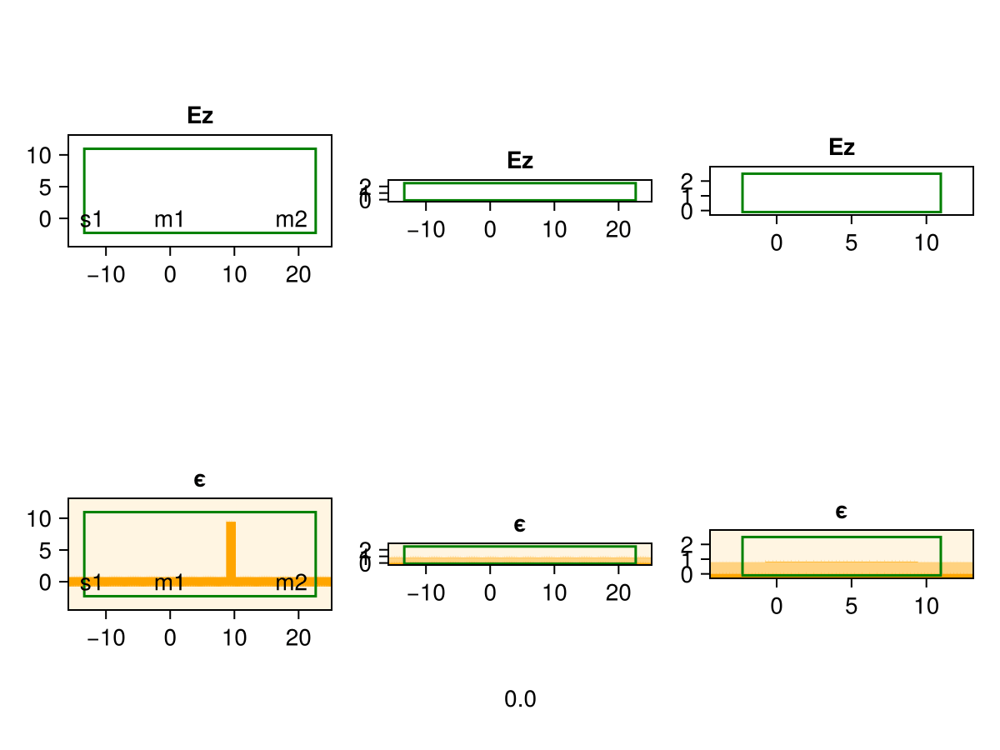
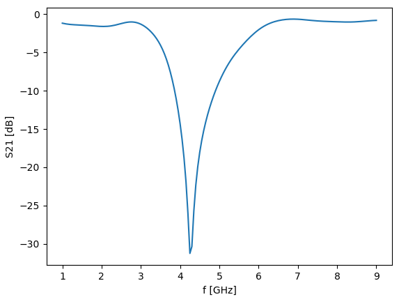

# Luminescent AI - FDTD Simulation and Inverse Design

2025/08/15  
v1.0.54  
Paul Shen  
<pxshen@alumni.stanford.edu>  

# Summary

Luminescent AI enables generative design and simulation of electromagnetic structures  in just a few lines of code! We help design next generation photonic integrated circuits, optical metasurfaces, RF and microwave circuits, and antennas in diverse industries including consumer electronics, automotive, telecom, datacenters and quantum computing. We created an **automatic differentiation (AD) compatible** and **GPU-accelerated** finite difference time domain (FDTD) simulator and geometry generator.

Experimental release 🥼. Expect critters  🐛🐞

# Features
**Powerful**
- Generative inverse design and simulation in just few lines of Python code!
- Broadband and multimode S-parameters 
- Embedded mode solver for modal sources and monitors
- .gds and `gdsfactory` integration
- .stl / .step  3D geometry import

**Fast**
- GPU acceleration on NVIDIA, AMD, and Apple Silicon
- Adaptive graded mesh reduces cell count
- Tensor subpixel smoothing boosts accuracy

**Smart**
- Fully differentiable (native automatic differentiation in Julia)
- Simultaneous inverse design of multiple 2D and 3D structures
- Length scale controlled geometry optimizer with fabrication constraints

**Comprehensive** (some features require additional dev)
- Modal sources, plane waves, Gaussian beams, custom sources
- Oblique sources and monitors
- PML, periodic, Bloch, PEC boundaries
- Near and far field radiation patterns
- Nonlinear, dispersive and anisotropic materials

# Examples
Test drive any of the examples below for free on Google Colab GPUs!
## Simulation
### [Tutorial: photonic ring resonator](https://colab.research.google.com/drive/1NQ222-Odjz4Yg_ZguFyhLTMUplpKafgX?usp=sharing)  
### [Microwave frequency selective surface (FSS)](https://colab.research.google.com/drive/1R477Sk5y-qPRHokCeYm98U1Jo4C8qwR8?usp=sharing) | [video](https://www.youtube.com/watch?v=Uq7OnLmFSEk)
### [Microstrip quarter wavelength stub filter](https://colab.research.google.com/drive/1NqAf7z9sDB8BdkNkSDoP24ckSv0XYquH)
<!-- ### [Microstrip quarter wavelength stub filter](https://colab.research.google.com/drive/1b2g0k3j4a5c7d8f9e0b1c2d3e4f5g6h7?usp=sharing) | [video](https://www.youtube.com/watch?v=YzXyZzWwVvU) -->

## Inverse design
### [Tutorial: photonic wavelength demultiplexer](https://colab.research.google.com/drive/1vJ-y2NabANt9xD-hWUq0rTBaeLzaBzmG?usp=sharing) | [video](https://youtu.be/DX1_vPu0ngI)

### [Photonic symmetric crossing](https://colab.research.google.com/drive/1ah2517VuLNj0kUSyux2LGEtQppVClvNH?usp=sharing)

# Product
All installers are fully local and never expire.   

**Free**
- CPU + GPU binaries
- Simulation up to 0.5M cells
- Inverse design up to 20M cell-steps

**Pro**
- Everything in free
- Unrestricted size
- 1 year of updates and support

# Links
[GitHub](https://github.com/paulxshen/Luminescent.jl): Star us :) We respond to issues within a day  
[LinkedIn](https://www.linkedin.com/company/luminescent-ai/about): Follow us for new features and bug fixes  
[Company](luminescentai.com): Consulting, collaboration, publication, investment

Email: pxshen@alumni.stanford.edu  
WhatsApp: 650-776-7724  
WeChat: pxshen1230  
<!-- # Product tiers

```python
``` -->

<!-- # RF and microwave circuits
## Simulation examples
  -->
<!-- ## Inverse design examples
### Microstrip patch antenna
### Microstrip bandpass filter
### 3D printed RF lens -->
